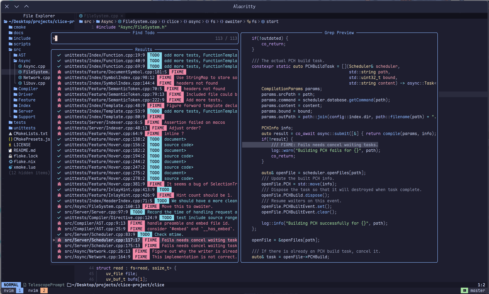

# YET ANOTHER NVIM CONFIG

A streamlined set of configurations for Nvim which is writen all *by hand*

> [!Warning]
>
> This config is no logger maintained. Please follow branch `main`

## ⚡Showcase ⚡




## Feature

- No more than 30 plugins

- Only with basic but necessary functionality

- Well organized code for beginers to understand

## ⚡Try it now⚡

You can try it immediately without replacing your origin configurations

```bash
./venv # Launch a virtual env shell, `nvim-debug` will be added to path automaticly
nvim-debug # Launch neovim on this config, without make changes to your ~/.local/share
```

## Basic functionalities

- [x] Auto complition

- [x] Status line

- [x] Color and comment highlight

- [x] File system explorer

- [x] Markdown preview

- [x] Outline

- [x] Intergrated terminal

- [x] Fuzzy finder

- [x] LSP support

- [x] Formatter

- [x] Ime auto switch(**Only on linux**)

## Maybe wanted features

- Use Render-Markdown instead of Markdown-Preview

- Latex preview

- IME switcher on MacOS -- *No idea how to impl*

## TODO List

- [ ] SSH Clipboard Support
