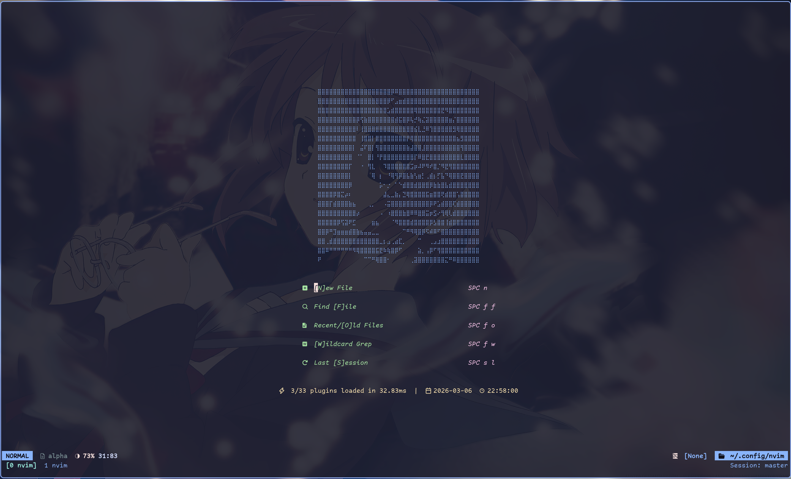
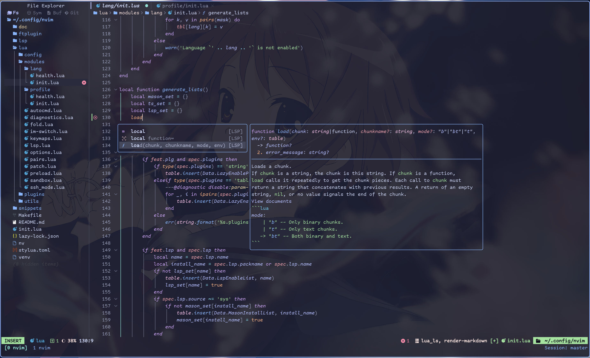

# YET ANOTHER NVIM CONFIG

English | [中文](./doc/README.zh_CN.md)

A streamlined set of configurations for Nvim which is writen all *by hand*

## ⚡Showcase ⚡





## Feature

- No more than 35 plugins

- Only with basic but necessary functionality

- Well organized code for beginers to understand

## ⚡Try it now⚡

You can try it immediately without replacing your origin configurations

```bash
./venv # Launch a virtual env shell, `nvim-debug` will be added to path automaticly
nv     # Launch neovim on this config, without make changes to your ~/.local/share
```

## Basic functionalities

- [x] Auto complition
- [x] Status line
- [x] Color and comment highlight
- [x] File system explorer
- [x] Markdown preview
- [x] Markdown renderer
- [x] Outline
- [x] Intergrated terminal
- [x] Fuzzy finder
- [x] LSP support
- [x] Formatter
- [x] Session recover
- [x] SSH clipboard support(**Need tmux extra config**)
- [x] Input method auto switch (**On Linux and MacOS**)

## Maybe wanted features

- [ ] Markdown Table Format

- [ ] Image preview in markdown(Partly support)

## TODO List

- [ ] Latex preview
