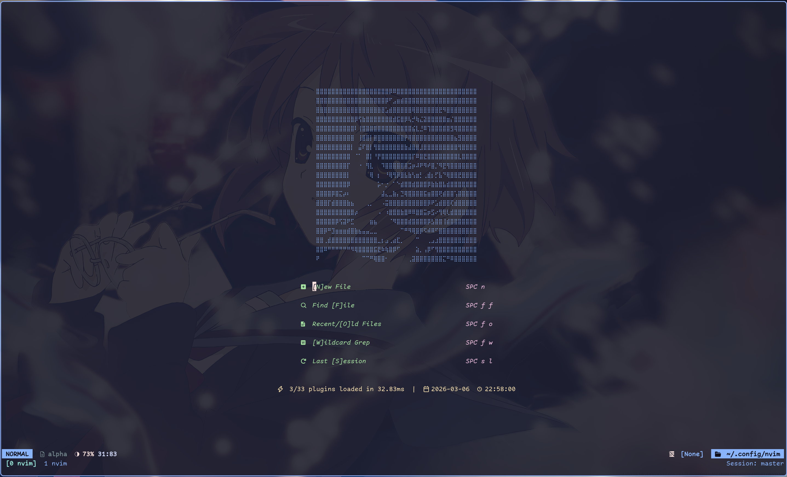
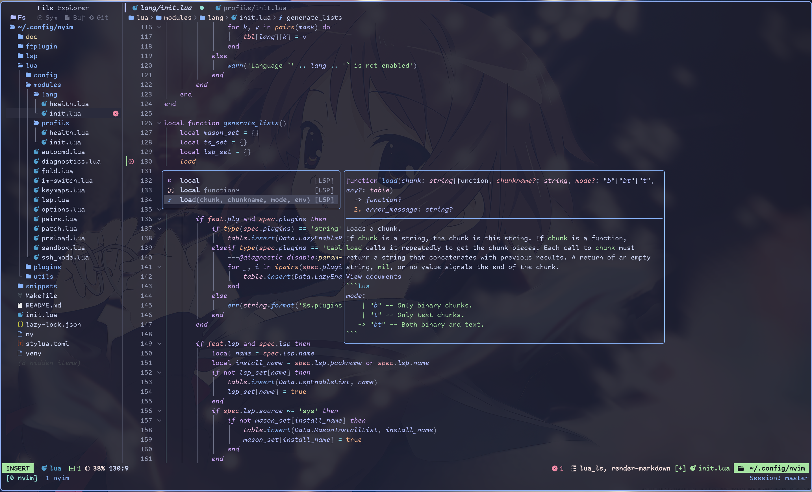

# YET ANOTHER NVIM CONFIG

English | [中文](./doc/README.zh_CN.md)

A **Modular & High-performance** set of configurations for Nvim which is written all ***by hand***

> [!NOTE]
>
> This config is used to be `streamlined`, why the complexity now?
> As the configuration grew, a flat structure became hard to maintain. 
> The new Modular Architecture separates Policy (what to enable) from Implementation (plugin setup).
> It is now a **data driven** configuration.
>  - lua/modules/profile/: Defines how the editor behaves.
>  - lua/modules/lang/: Defines what each language provides.
>  This makes the config a framework rather than just a set of dotfiles.

## ⚡Showcase ⚡





## Feature

- Modular Profile System: Switch between different configuration profiles seamlessly. Customize editor behavior on
  different device/os just by modify a json table.

- Granular Language Control: Fine-grained control over LSP, Treesitter, and Formatter on a
  per-language basis via environment variables.

- Dynamic Capabilities: Automatic adjustment of features based on the environment
  (e.g., Neovim version, environment variables).

- Well organized code(also well annotioned) for beginners to understand -- good code is the best document 😈😈😈

## Dependency

Some binaries should be installed before launch the configuration.

- `make` for markdown previewer

- `yarn` for markdown previewer

- `rg` for fuzzy finder

- `fzf` for fuzzy finder

- `gcc/clang` anyways, a c compiler for tree-sitter parser compilation

- `tree-sitter` required by nvim-treesitter

- `fcitx5-remote` *Linux,MacOS* for ime-switcher

- `win32yank.exe` *Windows* for system clipboard support

- `cargo` full rust toolchain, **optionally** required by blink.cmp

## ⚡Try it now ⚡

You can try it immediately without replacing your origin configurations.

```bash
./venv # Launch a virtual env shell, it's actually a sanbox shell that isolates plugins, cache and runtime file

vi     # Launch neovim on this config, without make changes to your ~/.local/share
```

Or, you may download the repo to `~/.config/<name>`, and run `NVIM_APPNAME=<name> nvim` to launch

## Implemented functionalities

- [x] Auto completion
- [x] Status line
- [x] Color and comment highlight
- [x] File system explorer
- [x] Markdown preview
- [x] Markdown renderer
- [x] Outline
- [x] Integrated terminal
- [x] Fuzzy finder
- [x] LSP support
- [x] Formatter
- [x] SSH clipboard support(**Need tmux extra config**)
- [x] Input method auto switch (**On Linux and MacOS**)
- [x] Workspace patch
- [x] Typst support
- [x] Task runner infrastructure (**Overseer**)
- [x] Windows Support
- [x] Centralized lang feature switch
- [x] Json-env combined profile system

## Optional features

Some features are optional, controlled by a json file -- `nvimrc.json`, this file should be placed under your config
dir. Here're customizable items:

- UI
    - *`transparent_mode`* enable transparent mode 
    - *`dashboard_art_name`* choose an ascii art on dashboard
    - *`statline_scrollbar_style`* choose a style for heirline scroll bar, which displays cursor position
    - *`diagnose_inline`* do not use virtual lines to display diagnostic messages
    - *`enable_current_line_blame`* enable virtual text line blame at the end of line

- Lang module
    - *`silent_lang_diag`* do not output log of lang loader
    - *`lang_blacklist`* disabled lang configs, default none, split by ','
    - *`lang_whitelist`* enabled lang configs, default all, split by ','
    - *`lang_levels`* lang feature config, syntax: string `c:full;cpp:none;rust:lsp,+ts,-fmt` means enable full 
    feature for c, disable all features for cpp, enable tree-sitter and lsp, disable formatter for rust.

- Lsp
    - *`enable_lsp`* enable lsp **Disable LSP if nvim version <= 0.11**
    - *`use_emmylua_ls`* use `emmylua_ls` as lua language server
    - *`workspace_inject_plugin_path`* inject plugin path to `emmylua_ls` workspace config
    - *`workspace_inject_vim_rt`* inject vim runtime to `emmylua_ls` workspace config

- Misc
    - *`sandbox_mode`* control sanbox features `sesson|undo|shada|swap|wb`, `wb` for writebackup
    - *`silent_profile_diag`* do not output log of profile loader
    - *`disable_im_switch`* disable auto im switcher
    - *`blink_use_binary`* use prebuild binary instead of building

Here are defaults:

```lua
local defaults = {
  blink_use_binary = true,
  dashboard_art_name = "Ayanami Rei",
  diagnose_inline = false,
  disable_im_switch = false,
  enable_current_line_blame = false,
  enable_lsp = true,
  lang_blacklist = "all",
  lang_levels = "",
  lang_whitelist = "",
  sandbox_mode = "none",
  silent_lang_diag = false,
  silent_profile_diag = false,
  statline_scrollbar_style = "moon",
  transparent_mode = false,
  use_emmylua_ls = false,
  workspace_inject_plugin_path = false,
  workspace_inject_vim_rt = true
}
```

> [!NOTE]
>
> Environment variables are still available. They have higher priority than json configured values.

## Design philosophy

Unlike standard Neovim distributions that focus on being a "bundle" of features,
this configuration is architected as a **Configuration Engine**. It treats configuration as structured data
and the loading process as a controlled pipeline.

### 1. Separation of Mechanism and Policy

The core of this setup is the **Mechanism** (the Loader). It doesn't care *what* is being loaded;
it only cares about *how* to scan directories, resolve module paths, and aggregate data.
The **Policy** (`LangSpec` or `PluginSpec`) is pure data.

* **Benefit**: You can add support for a new language by creating a single declarative file without touching the
  orchestration logic.

### 2. Environment-Driven Runtime Masking

This editor should adapt to context without code changes. By utilizing environment variables like
`NVIM_LANG_WHITELIST` and `NVIM_LANG_BLACKLIST`, the configuration allows for "Runtime Masking."

* **The Logic**: Whitelists act as a "Permit" that overrides any "Deny All" blacklist.
* **Use Case**: Debugging a core issue? Execute `NVIM_LANG_BLACKLIST=all nvim` for a clean slate instantly.

### 3. Structured Atomicity

Every module (e.g., `config.langs.python`) is an atomic unit. I use a **Recursive Path Stack** during loading to
ensure that the hierarchy of your filesystem is reflected in the resulting configuration state.
This avoids global namespace pollution and makes "Configuration Collections"
(one file defining multiple sub-entities) possible and safe.

### Comparison: Distro / Typical nvim config vs. This Engine


| Feature | Typical Distro | This Configuration |
| --- | --- | --- |
| **Loading** | Procedural & Linear | Scanned & Aggregated |
| **Toggling** | Hardcoded Booleans | Semantic Env Masks (+/-) |
| **Data Structure** | Imperative Setup Calls | Declarative Specs (Schema-driven) |
| **Philosophy** | "Include Everything" | "Load only what's whitelisted" |


## Maybe wanted features

- Markdown Table Format

- Image preview in markdown(Partly support)

- Search enhance

- Fold range highlighting on unfolding

- AsciiMode -- No nerd font

## TODO List

- Latex preview

- Collect assets and remove some hard coded options

> **This readme is partial generated by generative AI, but highly audited by human**
