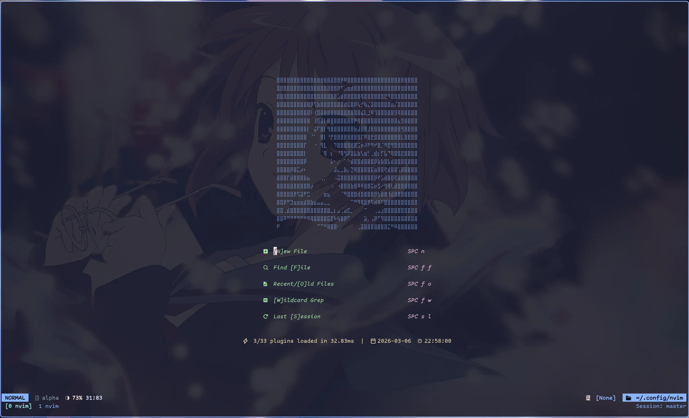
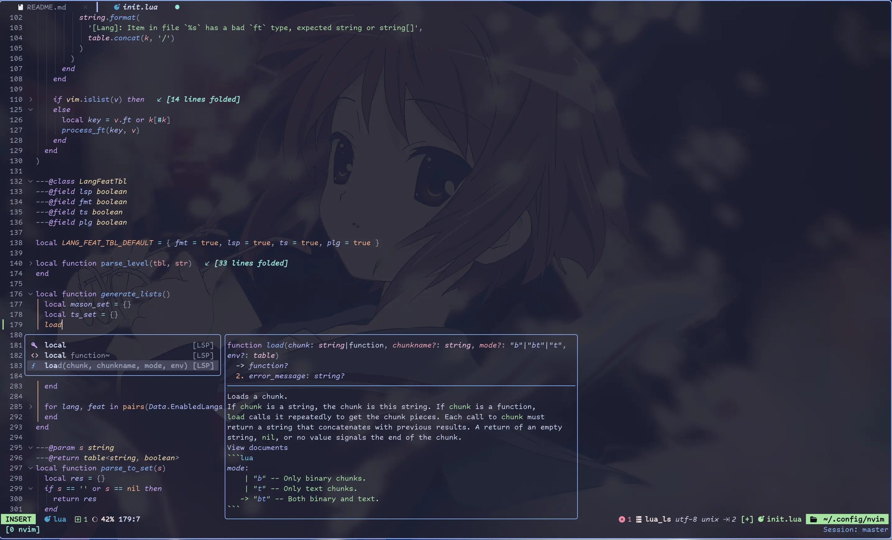

# 又一个 NVIM 配置

[English](../README.md) | 中文

一套**模块化且高性能**的 Nvim 配置，全部***手工***编写

> [!NOTE]
>
> 这套配置原本是“精简版”的，为什么现在变得复杂了呢？
> 随着配置的不断增长，扁平化的结构变得难以维护。
> 新的模块化架构将策略（启用哪些功能）与实现（插件设置）分离。
> 现在，它是一种**数据驱动的**配置。
>
> - `lua/modules/profile/` 定义编辑器的行为方式。
> - `lua/modules/lang/` 定义每种语言提供的功能。
>   这使得该配置成为一个框架，而不仅仅是一组点文件。

## 示例展示





## 功能

- 模块化配置文件系统：在不同配置配置文件之间无缝切换。只需修改 JSON 表，即可自定义编辑器在不同设备/操作系统上的行为。

- 细粒度语言控制：通过环境变量，对 LSP、Treesitter 和 Formatter 进行精细控制，

- 完全由自行实现的运行时层构成：摒弃了 `noice` 和 `snacks`，用简单易懂的代码实现提升用户体验的功能，完全不需要任何理解能力。

- 动态功能：根据环境自动调整功能（例如，Neovim 版本、环境变量）。

- 代码组织良好(注释也很详细), 便于初学者理解——良好的代码就是最好的文档😈😈😈

## 依赖项

在运行配置之前，需要安装一些二进制文件。

- `make` 用于 Markdown 预览器

- `yarn` 用于 Markdown 预览器

- `rg` 用于模糊查找器

- `fzf` 用于模糊查找器

- `gcc/clang` 一個 c 編譯器, 用于 tree-sitter 解析器编译

- `tree-sitter` 被 `nvim-treesitter` 需要

- `fcitx5-remote`（Linux、MacOS 系统）用于 ime-switcher（输入法切换器）

- `win32yank.exe`（Windows 系统）用于系统剪贴板支持

- `cargo` 完整的 `rust` 工具鏈, 是 `blink.cmp` 的可選依賴

## 立即尝试

无需修改您的原始配置，即可立即尝试。

```bash
./venv # 启动一个虚拟环境 shell，它实际上是一个沙盒 shell，隔离了插件、缓存和运行时文件
nvim # 在此配置下启动 Neovim，无需修改您的 ~/.local/share 文件
```

或者，您可以将仓库下载到 `~/.config/<name>`, 然后运行 `NVIM_APPNAME=<name> nvim` 来启动它。

## 基本功能

- [x] 自动补全
- [x] 状态栏
- [x] 颜色和注释高亮
- [x] 文件系统资源管理器
- [x] Markdown 预览
- [x] Markdown 渲染器
- [x] 大纲
- [x] 集成终端
- [x] 模糊查找器
- [x] LSP 支持
- [x] 格式化程序
- [x] SSH 剪贴板支持（**需要 tmux 额外配置**）
- [x] 输入法自动切换（**仅限 Linux 和 macOS**）
- [x] 工作区补丁
- [x] Typst 支持
- [x] Windows 支持
- [x] 集中式语言特性开关
- [x] Json-env 组合配置文件系统

## 可选特性

某些功能是可选的，由一个json文件——`nvimrc.json` 控制，该文件应放置在您的配置目录下。
以下是可自定义项目：

<!-- docgen@profile -->

- 大文件支持
  - _`bigfile_size_byte`_ — 平均字节大小
    - **Type:** `number`
    - **ENV:** `NVIM_BIGFILE_SIZE_BYTE`
    - **Defaults:** `2097152`

  - _`bigfile_size_line`_ — 平均行长度（适用于压缩文件）
    - **Type:** `number`
    - **ENV:** `NVIM_BIGFILE_SIZE_LINE`
    - **Defaults:** `100000`

- 语言模块
  - _`lang_blacklist`_ — 禁用语言配置，默认禁用，以逗号分隔
    - **Type:** `string`
    - **ENV:** `NVIM_LANG_BLACKLIST`
    - **Defaults:** `'all'`

  - _`lang_levels`_ — 语言特性配置
    语法：字符串 `c:full;cpp:none;rust:lsp,+ts,-fmt` 表示启用 C 语言的全部功能,
    禁用 C++ 的所有功能，启用 tree-sitter 和 lsp，禁用 Rust 的格式化程序.
    - **Type:** `string`
    - **ENV:** `NVIM_LANG_LEVELS`
    - **Defaults:** `''`

  - _`lang_whitelist`_ — 启用语言配置，默认启用，以逗号分隔
    - **Type:** `string`
    - **ENV:** `NVIM_LANG_WHITELIST`
    - **Defaults:** `''`

- LSP
  - _`clang_format_path`_ — 指定 `clang-format` 二进制文件路径
    - **Type:** `string`
    - **ENV:** `NVIM_CLANG_FORMAT_PATH`
    - **Defaults:** `'clang-format'`

  - _`clangd_path`_ — 指定 `clangd` 二进制文件路径
    - **Type:** `string`
    - **ENV:** `NVIM_CLANGD_PATH`
    - **Defaults:** `'clangd'`

  - _`emmy_inject_plugin_path`_ — 将插件路径注入到 `emmylua_ls` 工作区配置中
    - **Type:** `boolean`
    - **ENV:** `NVIM_EMMY_INJECT_PLUGIN_PATH`
    - **Defaults:** `false`

  - _`emmy_inject_vim_rt`_ — 将 Vim 运行时注入到 `emmylua_ls` 工作区配置中
    - **Type:** `boolean`
    - **ENV:** `NVIM_EMMY_INJECT_VIM_RT`
    - **Defaults:** `true`

  - _`enable_inlay_hint`_ — 默认开启 lsp 的 inlay hint 特性如果有此能力
    - **Type:** `boolean`
    - **ENV:** `NVIM_ENABLE_INLAY_HINT`
    - **Defaults:** `false`

  - _`use_emmylua_ls`_ — 使用 `emmylua_ls` 作为 Lua 语言服务器
    - **Type:** `boolean`
    - **ENV:** `NVIM_USE_EMMYLUA_LS`
    - **Defaults:** `false`

- 其他
  - _`blink_use_binary`_ — blink.cmp 使用预编译二进制文件代替自行编译
    - **Type:** `boolean`
    - **ENV:** `NVIM_BLINK_USE_BINARY`
    - **Defaults:** `true`

- 持久化
  - _`persist_local_dir`_ — 用于存放工作区本地持久化数据的目录（相对于工作区根目录）。
    - **Type:** `string`
    - **ENV:** `NVIM_PERSIST_LOCAL_DIR`
    - **Defaults:** `'.cache/nvim/'`

  - _`persist_local_mode`_ — 将指定的持久化功能存储到当前工作区。支持：`session|undo|shada|swap`。
    - **Type:** `string`
    - **ENV:** `NVIM_PERSIST_LOCAL_MODE`
    - **Defaults:** `'none'`

  - _`persist_mode`_ — 启用持久化功能。支持：`session|undo|shada|swap`
    - **Type:** `string`
    - **ENV:** `NVIM_PERSIST_MODE`
    - **Defaults:** `'none'`

- 生活质量(QoL)
  - _`disable_im_switch`_ — 禁用自动输入法切换
    - **Type:** `boolean`
    - **ENV:** `NVIM_DISABLE_IM_SWITCH`
    - **Defaults:** `false`

  - _`use_neogit`_ — 使用 [`neogit`](https://github.com/neogitorg/neogit) 作为增强的 git 客户端.
    - **Type:** `boolean`
    - **ENV:** `NVIM_USE_NEOGIT`
    - **Defaults:** `false`

  - _`use_ufo_as_fold_provider`_ — 使用 [`nvim-ufo`](https://github.com/kevinhwang91/nvim-ufo) 作为默认的折叠提供来源, 获得更好的代码折叠体验.
    - **Type:** `boolean`
    - **ENV:** `NVIM_USE_UFO_AS_FOLD_PROVIDER`
    - **Defaults:** `false`

- 终端
  - _`integrated_terminal_shell`_ — 为集成终端设置 shell, 默认为 zsh
    - **Type:** `string`
    - **ENV:** `NVIM_INTEGRATED_TERMINAL_SHELL`
    - **Defaults:** `'zsh'`

- 用户界面
  - _`dashboard_art_name`_ — 选择仪表盘上的 ASCII 艺术字
    - **Type:** `DashboardArtName`
    - **ENV:** `NVIM_DASHBOARD_ART_NAME`
    - **Defaults:** `'Ayanami Rei'`

  - _`diagnose_level`_ — 要显示的最低诊断信息级别
    - **Type:** `DiagnoseLevel`
    - **ENV:** `NVIM_DIAGNOSE_LEVEL`
    - **Defaults:** `'hint'`

  - _`diagnose_mode`_ — 诊断显示级别，
    选项为 `'inline'|'detailed'|'pretty'`，`inline` 表示使用虚拟文本显示诊断信息，
    `detailed` 表示使用额外的虚拟行显示诊断信息，`pretty` 表示使用额外的插件
    -- `tiny-inline-diagnostic` 用于显示诊断信息，默认为 `inline`
    - **Type:** `DiagnoseMode`
    - **ENV:** `NVIM_DIAGNOSE_MODE`
    - **Defaults:** `'inline'`

  - _`diagnose_with_fancy_underline`_ — 是否使用花哨的下划线，**需要终端和 tmux 支持**
    - **Type:** `boolean`
    - **ENV:** `NVIM_DIAGNOSE_WITH_FANCY_UNDERLINE`
    - **Defaults:** `false`

  - _`enable_current_line_blame`_ — 启用行尾的虚拟文本行 git blame 显示
    - **Type:** `boolean`
    - **ENV:** `NVIM_ENABLE_CURRENT_LINE_BLAME`
    - **Defaults:** `false`

  - _`enable_relative_lnum`_ — 使用相对行号
    - **Type:** `boolean`
    - **ENV:** `NVIM_ENABLE_RELATIVE_LNUM`
    - **Defaults:** `false`

  - _`enable_sticky_buffer`_ — 为每个窗口启用粘性缓冲区
    - **Type:** `boolean`
    - **ENV:** `NVIM_ENABLE_STICKY_BUFFER`
    - **Defaults:** `false`

  - _`statline_scrollbar_style`_ — 选择用于显示光标位置的滚动条样式
    - **Type:** `StatusScrollbarStyle`
    - **ENV:** `NVIM_STATLINE_SCROLLBAR_STYLE`
    - **Defaults:** `'moon'`

  - _`transparent_mode`_ — 启用透明模式
    - **Type:** `boolean`
    - **ENV:** `NVIM_TRANSPARENT_MODE`
    - **Defaults:** `false`

- 工作区
  - _`allow_workspace_patch`_ — 允许编辑器根据工作区配置修改其行为
    - **Type:** `boolean`
    - **ENV:** `NVIM_ALLOW_WORKSPACE_PATCH`
    - **Defaults:** `false`

  - _`workspace_patch_always_restrict`_ — 始终启用限制模式. 禁用 `dofile` 以防止 **任意代码执行**
    - **Type:** `boolean`
    - **ENV:** `NVIM_WORKSPACE_PATCH_ALWAYS_RESTRICT`
    - **Defaults:** `true`

    <!-- enddoc@profile -->

> [!NOTE]
>
> 环境变量仍然可用，且优先级高于 JSON 配置值。

## 可能需要的功能

- Markdown 表格格式

- Markdown 中的图像预览（部分支持）

- 搜索增强

- 代码折叠范围在展开时高亮

## 待办事项列表

- LaTeX 预览

- 收集默認值, 並移除硬編碼選項

> **該簡體中文版本完全由谷歌翻譯生成**
