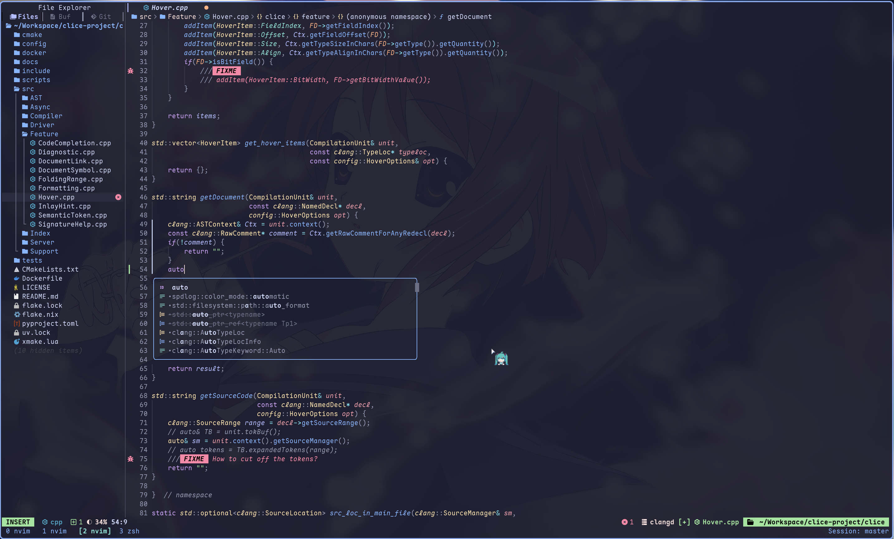

# 又一个 Neovim 配置

[English](../README.md) | 中文

一个 **完全手写**、轻量且简洁的 Neovim 配置方案。

## ⚡效果展示 ⚡




## ✨ 特点

- 插件数量不超过 **35 个**  
- 仅包含最基础且必要的功能  
- 代码结构清晰，初学者也能轻松理解  

## 🚀 立即尝试

无需替换你原有的配置，直接运行即可体验：

```bash
./venv        # 启动虚拟环境，自动将 `nvim-debug` 添加到 PATH
nvim-debug    # 使用本配置启动 Neovim，不会修改你的 ~/.local/share
````

## 📦 基础功能

* [x] 自动补全
* [x] 状态栏
* [x] 语法高亮 & 注释高亮
* [x] 文件浏览器
* [x] Markdown 预览
* [x] Markdown 渲染
* [x] 大纲视图
* [x] 内置终端
* [x] 模糊搜索
* [x] LSP 支持
* [x] 代码格式化
* [x] 会话恢复
* [x] SSH 剪贴板支持（**需 tmux 额外配置**）
* [x] 输入法自动切换（**支持 Linux 与 MacOS**）

## 也许想要的功能
- [ ] Markdown文档图片预览(部分支持)
* [ ] Markdown 表格格式化

## 🌟 计划中的功能

* [ ] LaTeX 预览
